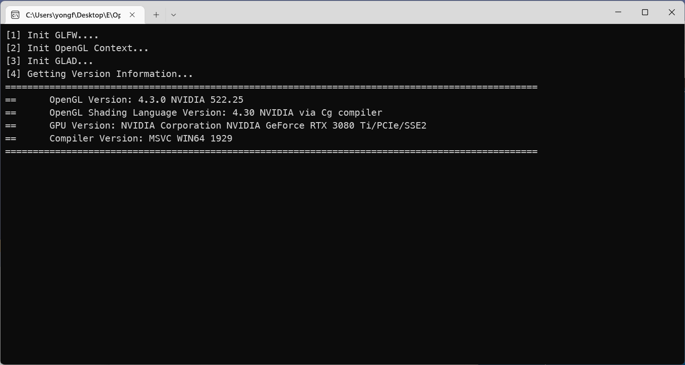
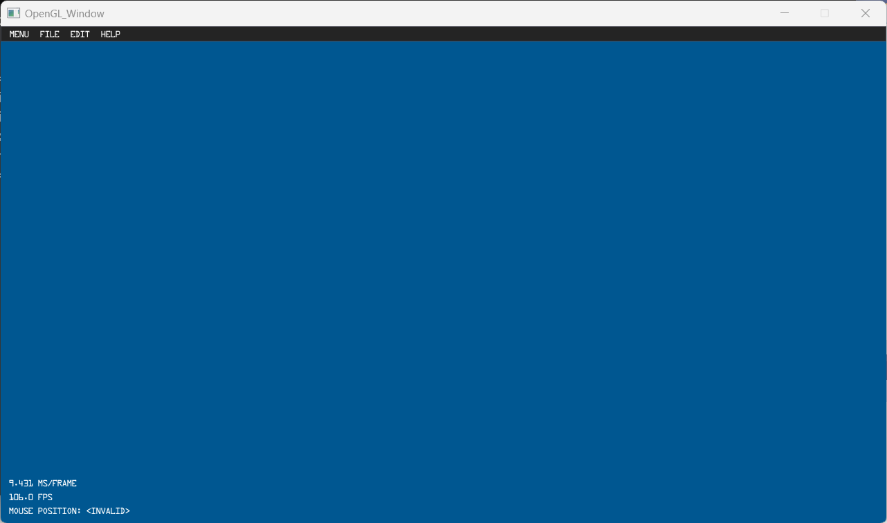

# OpenGL FrameWork 
---
This framework simulates the rendering process of the **Unity Engine**.

This version is currently adapted to versions after OpenGL 3.3. If you need to adapt to previous versions, please overwrite all files in inside GL30.
### Usage
I added a very rough CMakeList.txt. Currently itr should be compatible with Windows and MacOS.
### Current features included
- MemoryPool
  - TLSF algorithm is used for memory management. Please refer to **MemoryLabel.h** for different memory allocation.
- ThreadPool
  -  Pleas refer to the content under folder **ThreadPool**
- Builtin program
  - skybox, ground, quad for debug FBO content, and also some built-in hardcode shade files.
- Debugg and Log
  - Pleas refer to the content under folder **Debugger**, call the API:```OGL_CALL();``` ```Debug();``` ```Error();``` ```Info();``` 
- Geometry
  - At present, only a few geo-related files are included, including arrow, circle, plane, and rectangle.
  - **TODO:** AABB, RAY, CURVE(Bézier, B-spline), Intersection test
- GL30
  - This is the core of rendering , including VAO, VBO, EBO, FBO, RBO, Texture2D, TextureCube
  - Theoretically, it supports **OpenGL 3.0**. If you want to be backward compatible, youu just need to overwrite everything under the **GL30**.
- PBA
  - Contains components with physics properties for physically based animations. Pay attention to the namespace when calling ```PBA::```
- Utils
  - Miscellaneous items
  - Includes serveal useful tools, including **File IO**, **String processing**, **GLMath**, **Timer**, **LinkedList**, **Smart Ptr** and **output of vector or matrixx**
- The rendering process is material-based(I encapsulated the rendedring process of OpenGL)
- If you create program based on this project, you should write all initialize and render codes in the **Scene.cpp / Scene.h**
- Some common geometric models are included in Res, as well as a font I really into.
----
An object contains a material, and a material has two rendering passes, namely the main pass and the sub-pass. Key lights and shadows should be done in the master pass. I have encapsulated Attribute and Uniform. These two components should be managed by rendering channels, not Shader. Shader should only be responsible for passing messages from the CPU to the GPU, it does not need to know the specific content of the message


### Third library
This proj contains many third-library, and for some libraries, it is redundatn, but just in case. You can choose or delete according to your preference.

- **GLFW** (GLFW provides a simple API for creating windows, contexts, and surfaces, receiving input and events.) 
- **GLAD** (GLAD is a Multi-Language GL/GLES/EGL/GLX/WGL Loader-Generator based on the official specs.)
- **GLM** (OpenGL Mathematics (GLM) is a header-only C++ mathematics library for graphics software based on the OpenGL Shading Language (GLSL) specifications.
- **Eigen** (Eigen is a C++ template library for linear algebra: matrices, vectors, numerical solvers, and related algorithms.)
- **ImGui** (ImGui is a bloat-free graphical user interface library for C++.)
- **ImGuizmo** (ImGizmo is a small (.h and .cpp) library built ontop of Dear ImGui that allow you to manipulate(Rotate & translate at the moment) 4x4 float matrices. No other dependancies. Coded with Immediate Mode (IM) philosophy in mind.)
- **ImGuiFileDialog** (ImGuiFileDialog is a file selection dialog built for (and using only) Dear ImGui.)
- **ASSIMP** (A library to import and export various 3d-model-formats including scene-post-processing to generate missing render data.)
- **tiny_loader** (Tiny but powerful single file wavefront obj loader written in C++03. No dependency except for C++ STL. It can parse over 10M polygons with moderate memory and time.)
- **stb_image** (Decoding almost all type images I.e. JPG, PNG.)
- **svpng.inc** (A minimalistic C function for saving RGB/RGBA image into uncompressed PNG.)
- **EasyBMP** (EasyBMP is a simple, cross-platform, open source (revised BSD) C++ library designed for easily reading, writing, and modifying Windows bitmap (BMP) image files.)

----
Using this proj to finish the course assignment of [ICG](https://graphics.cs.utah.edu/courses/cs6610/spring2022/) (Pleas check the examples folder.) 
I've been quite busy for my final project which has taken up most of my spare time and it's likely this'll remain for a while.  I'll get back to it eventually, but can't make any promises as to when.

This is environmenet I use most of it.

**AS1**
